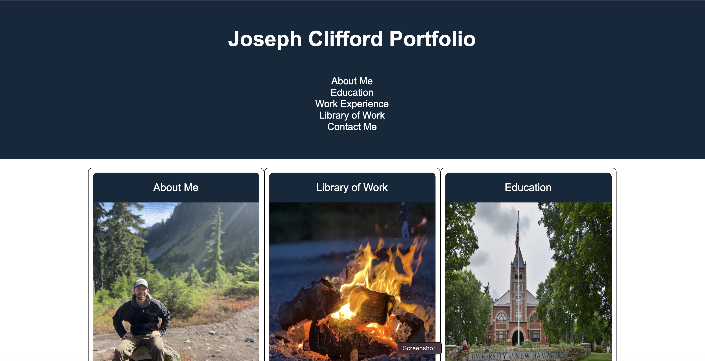
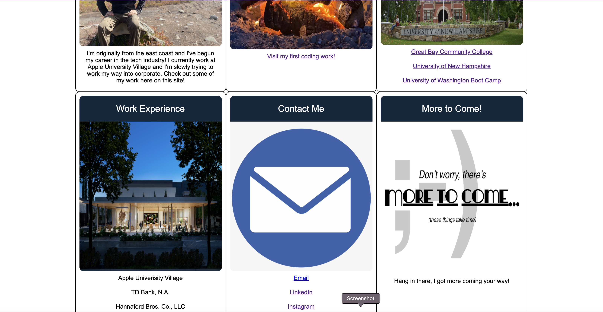

For this assignment we were tasked to construct a portfolio showing our work and ways to contact us. 

I started with the html building a header, nav links, and cards to fit within the page. From there I did some work gathering my images from my own body of 
work to a few reference images from Google. I then decided what links I wanted to attach to my page, from the work I've done in this course (which unfortunately
is not much, yet!) but also some links to my LinkedIn profile, my instagram, and I even attempted to generate an email link which seems to work sparingly. 

Once I added in all these elements I worked on constructing my layout and fitting everything with a layout designed for mobile devices and tablets. 

Heres a few screenshots of the page I developed and the link as well!

